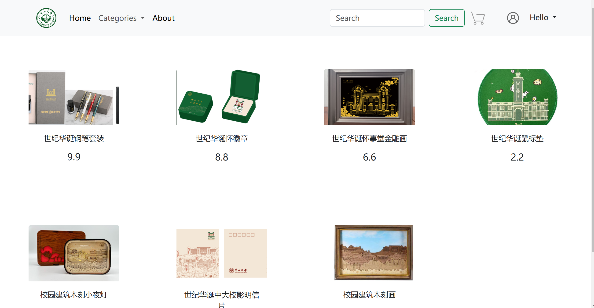

# DoovvvMall
Project for the course "Database System" at the University of Sun-yat-Sen University, which chinese name is "中大世纪华诞文创商城"  
## Tech stack
architecture: Micro-service  
frontend: golang/html/template+css:bootstrap  
backend: golang/hertz  
## Demo display

## Reference
[教程](https://www.bilibili.com/video/BV1bf421o7NM?vd_source=1b27bec8aa00a8aea9a09874d684b2dc)